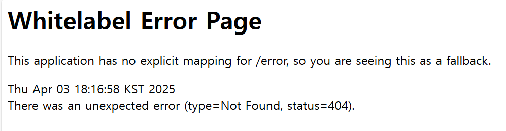

## Web

프로토콜을 기반으로 정보를 연결하고, 브라우저를 통해 접근할 수 있는 정보 시스템

## Client - Server Paradigm

**Client** : 서버에 연결하고 통신을 시도하는 쪽이며 항상 연결되어 있는 것은 아님. Dynamic IP를 사용하고 클라리언트끼리는 직접 통신하지 않는다. 데이터의 생성, 조회, 수정, 삭제 요청 등을 전송한다.

**Server** : 항상 켜져 있는 장치, 고정 IP주소를 가지고 있으며, 데이터 센터에 위치하는 경우가 많다. 클라이언트의 요청대로 동작을 수행하고 응답을 전송한다.

## HTTP

HTTP = HyperText Transfer Protocol, Web의 Application Layer의 Protocol이다.

HTTP 는 **Stateless**하다!! → 서버는 이전 클라이언트 요청에 대한 정보를 저장하지 않는다.

상태를 유지하는(state) 프로토콜은 복잡하다. 과거 요청 내역을 서버가 계속 기억해야 하며, 서버나 클라이언트가 오류가 나면 상태 불일치가 생길 수 있다.

→ **쿠키**와 **세션** 기술이 도입되기 시작한다.

### 주요 명령어

<aside>
📖

- GET : 데이터 조회
- POST : 데이터 생성
- PUT : 데이터 전체 교체
- PATCH : 데이터 부분 수정
- DELETE : 데이터 삭제
</aside>

**HTTP 헤더** : 통신에 대한 정보가 들어있다. 보낸 일시, 송신자가 누구인지, 종류, 경로 등..

**HTTP 바디** : 주고 받으려는 데이터(json)

## Frontend

사용자가 직접 **보는 영역**을 담당하며 웹 브라우저에서 실행된다. 사용자가 웹 페이지에서 보는 화면, 버튼, 폼, 애니메이션 등..

- 주요 기술:
    - **HTML**: 구조
    - **CSS**: 디자인/스타일
    - **JavaScript**: 동작/인터랙션

## Backend

웹사이트의 **서버, 데이터베이스**를 담당하며 사용자가 직접 보는 영역 너머의 동작을 지원한다. 데이터 처리 밎 저장, 회원 정보 관리, 사용자 인증 등…

→ 사용자가 입력한 데이터를 받아 처리하거나, DB에 저장하고 다시 돌려주는 역할

→ 프론트엔드가 화면에 채울 컨텐츠 데이터를 백엔드에 요청하면, 백엔드는 DB에서 가져온 데이터를 응답한다.

## API (Application Programming Interface)

- **프론트엔드와 백엔드**가 소통하는 **통신 인터페이스**
- 어떤 HTTP method, url 등을 사용해야 하는지, 각 요청에 어떤 응답을 해야하는지 **세부 규칙**을 정해놓은 것.

# API - Method, URL

<**만들 목록**>

- 회원가입 / 로그인
- 나의 할 일 생성/ 조회/ 수정/ 삭제
- 나의 할 일 체크/ 체크 해제
- 친구 찾기/ 팔로우/ 언팔로우/ 친구 리스트 조회
- 특정 친구의 할 일 조회

| 기능 | HTTP Method | URL | 비고 |
| --- | --- | --- | --- |
| 회원가입 | POST | /register |  |
| 로그인 | POST | /login | GET으로 설계 시 개인정보 노출 위험 |
| 나의 할 일 생성 | POST | /todo |  |
| 나의 할 일 조회 | GET | /todo/list |  |
| 나의 할 일 수정 | PATCH OR PUT | /todo/{todo_id} |  |
| 나의 할 일 삭제 | DELETE | /todo/{todo_id} |  |
| 나의 할 일 체크 | POST | /todo/{todo_id}/check |  |
| 나의 할 일 체크 해제 | POST | /todo/{todo_id}/uncheck |  |
| 친구 찾기 | GET | /mate/search |  |
| 친구 팔로우 | POST | /mate/{mate_id}/follow | PATCH로 설계 시 모든 회원의 팔로우 변수에 FALSE를 설정해 줘야 하므로 비효율적 |
| 친구 언팔로우 | DELETE | /mate/{mate_id}/unfollow | 위와 같은 이유 |
| 나의 친구 리스트 조회 | GET | /mate/list |  |
| 특정 친구의 할 일 조회 | GET | /mate/{mate_id}/todo |  |

## REMIND❗❗

<aside>
📖

- GET : 데이터 조회
- POST : 데이터 생성
- PUT : 데이터 전체 교체
- PATCH : 데이터 부분 수정
- DELETE : 데이터 삭제
</aside>

### ps. Error Page

