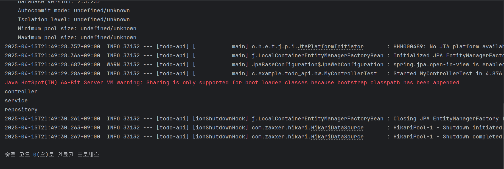

# 스프링 컨테이너, 빈

1. 스프링 빈 : 스프링이 관리하는 객체, 컨테이너에 빈을 저장해두고, 필요한 빈을 컨테이너에서 받아 사용한다.
2. 스프링 컨테이너 : 스프링 빈이 저장되는 공간, 어플리케이션 컨텍스트(Application Context) 라고도 함

## 빈 등록하기

### 수동 등록

```java
@Configuration // 설정 파일임을 명시한다.
public class AppConfig {
    @Bean // 수동 등록
    public MyRepository myRepository() {
        return new MyRepository();
    }
}
```

### 자동 등록 (추천)

```java
@Component // 또는 @Service, @Repository, @Controller
public class MyRepository {
    public void print() {
        System.out.println("Repository");
    }
}
```

# 의존성 주입 (Dependency Injection, DI)

객체 A가 객체 B의 기능을 필요로 할 때, A가 직접 B를 생성하지 않고 외부에서 주입받는 방식 → 스프링에서는 이 주입을 컨테이너가 자동으로 수행한다.

## 사용 이유

- 결합도를 낮춰 객체 간 유지보수가 쉽다. → 뭔가를 추가하거나 삭제할 때, 기본 코드에게 영향을 거의 주지 말아야 하는 객체 지향의 OCP 원칙을 준수한다.
- 중복 객체 생성을 방지하여 메모리 효율이 증가한다.

## 의존성 주입 방식

### 1. 생성자 주입

```java
@Getter
@Component
@RequiredArgsConstructor
public class MyService {
    private final MyRepository myRepository; // final이면 반드시 생성자 주입 필요
}
```

1. 의존성이 바뀔 일이 없는 경우 안전하게 final로 선언한다.
2. final 필드는 생성자를 통해 초기화되어야 한다.
3. 생성자에 @Autowired를 사용하면 생성자를 통해 빈을 주입하지만, 생성자가 하나뿐이라면 생략할 수 있다.
4. @RequiredArgsConstructor를 사용하면 생성자 코드를 생략할 수 있다.

### 2. 필드 주입

```java
@Component
public class MyService {
    @Autowired
    private MyRepository myRepository;
}
```

1. 필드에 바로 @Autowired 를 사용하며, final은 사용 불가하다.
2. 테스트 코드에서 사용하며, 운영 코드에서 작성 시 경고

- 세터 주입은 생략

## 예시 코드

### 컨트롤러 → 서비스 → 리포지토리

```java
@Component
public class MyRepository {
    public void printRepos() {
        System.out.println("repository");
    }
}

@Component
@RequiredArgsConstructor
public class MyService {
    private final MyRepository myRepository;

    public void printService() {
        System.out.println("service");
        myRepository.printRepos();
    }
}

@Component
@RequiredArgsConstructor
public class MyController {
    private final MyService myService;

    public void printController() {
        System.out.println("controller");
        myService.printService();
    }
}
```

### 테스트 코드

```java
@SpringBootTest
public class MyControllerTest {

    @Autowired
    private MyController myController;

    @Test
    void test() {
        myController.printController();
    }
}
```

### 결과 화면

