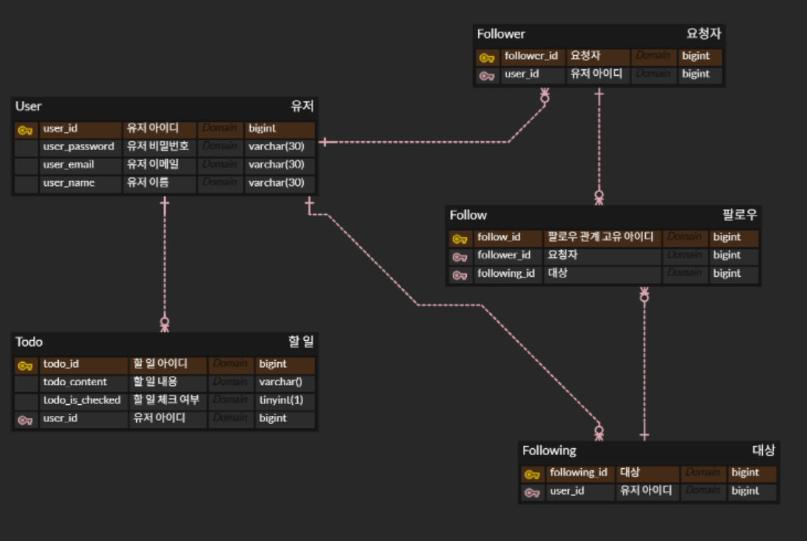
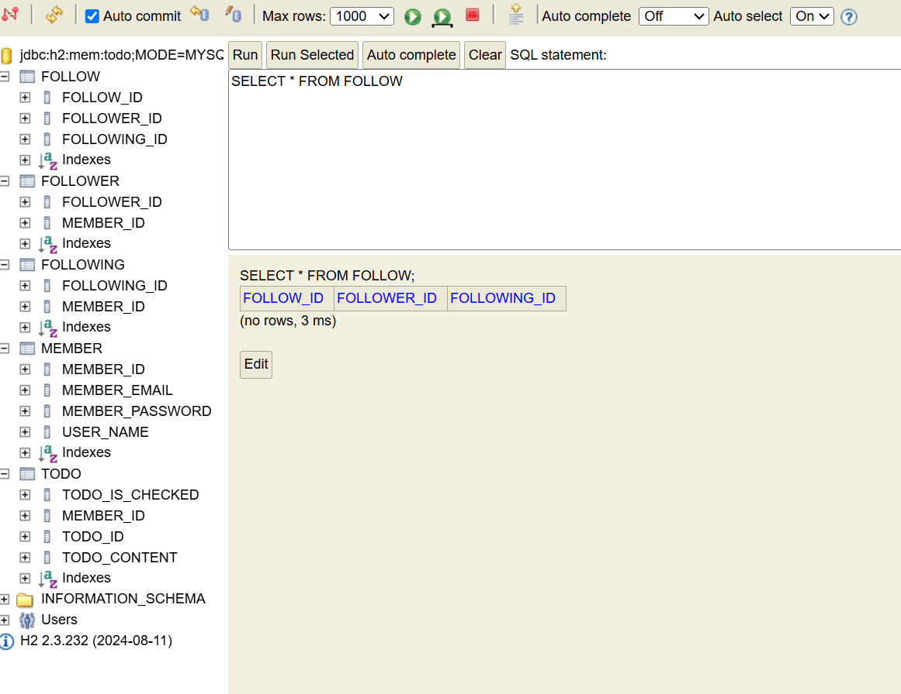

# Database 설계

데이터베이스는 다양한 문제 상황으로 얽혀 있으며 그것은 크게 개체와 개체 간의 관계로 나타낼 수 있다. 개체(Entity)는 문제 상황을 구성하는 요소이고, 관계(Relationship)은 개체와 개체 사이의 관계를 나타낸다. 이렇게 문제 상황을 개체와 관계로 표현하는 방법을 **ER Model**이라고 한다. ER Model을 다이어그램으로 표현한 것을 **ERD**라고 한다.

## ER Model

개체와 관계는 세부적 특징인 속성(Attribute)을 가질 수 있는데, 개체를 식별할 수 있는 대표적인 속성을 PK(Primary Key), 기본 키 라고 한다. 관계는 FK(Foreign Key), 외래 키로 표현할 수 있으며, 다른 테이블의 PK를 참조하는 키를 의미한다.

이때 관계에서는 Identifying Relationship(식별 관계)과 Non-Identifying Relationship(비식별 관계)으로 나뉠 수 있다. 관계 대상의 PK를 자신의 PK로도 사용하면 식별 관계, **관계 대상의 PK를 자신의 FK로만** 사용하는 것을 **비식별 관계**라고 하는데, 보통은 비식별 관계이다.

또한 관계는 그 특징에 따라 여러 종류로 나뉠 수 있는데,  1:N, N:1, N:N, 1:1일 수 있다. 1:N혹은 N:1은 외래 키로 구현할 수 있다. N:M 관계는 테이블로 구현한다. N과 M 쌍을 저장하는 테이블을 만들면 구현할 수 있다. 예를 들어 이번 과제에서 나온 팔로워와 팔로잉 관계를 보면.


PK인 팔로우 관계 고유 아이디를 이용해 두 N:M 요소를 한 테이블로 묶어 표현할 수 있다. 관계는 같은 종류의 유저 엔티티끼리도 맺을 수 있다.

## JPA

JPA는 Java Persistence API, 데이터베이스에서 읽어온 데이터를 자바 객체로 매핑하는 자바의 표준 기술이다. 여기에서 쓰는 엔티티의 개념은 자바와 데이터베이스가 소통하는 단위다. 테이블과 데이터 하나(레코드)는 엔티티 객체 하나로 매핑된다.

대략적인 과정은.

1. id가 1인 유저 데이터 조회 
2. JPA에서 SQL문을 생성하여 USER 데이터베이스에 요청
3. USER는 일정 형식으로 응답. → id가 1인 객체를 JPA에서 출력.
    
    → 우리는 SQL 문을 생성하여 응답하는 과정을 몰라도 출력받을 수 있음
    

이번 과제에서 DB는 H2 데이터베이스를 사용한다.

기본적으로 resource의 구성 파일에는 application.properties가 있다. 여기에 데이터베이스 접속 정보를 입력하면 JPA가 접속하여 정보를 분석하고 제공할 수 있다. 프로그래밍을 할 때에는 이 확장자(properties)를 yml로 바꾸는 것이 더 편리하다. yml에서는 콜론을 사용하여 구분하는 특징이 있다.

```java
spring:
  application:
    name: todo-api

  datasource: # 관리자 콘솔에 접속할 url을 설정한다.
    url: jdbc:h2:mem:todo;MODE=MYSQL # MySQL 처럼 사용

  h2:
    console:
      enabled: true # 관리자 콘솔을 활성화한다. 기본값은 False.

  jpa:
    show-sql: true # JPA가 생성한 SQL을 표시한다. 들여쓰기 적용.
    properties:
      hibernate:
        format_sql: true
        dialect: org.hibernate.dialect.MySQL8Dialect # SQL을 생성할 때, MySQL8을 사용한다.
```

코드를 실행하고 [localhost:8080/h2-console에](http://localhost:8080/h2-console에) 접속한 뒤 JDBC URL을 코드에서 설정한 대로 붙여넣어준다.


이제 todoapi안에 todo라는 패키지를 만들고 그 안에 Todo 클래스를 생성한다.

엔티티 클래스는 테이블을, 클래스 필드는 컬럼을 나타낸다.


→ JDA가 직접 실행한 SQL의 흔적


다시 콘솔을 보면 테이블과 필드가 추가되어있다.


실행하면 column과 타입이 나오는데, ERD에서 설정한 것과 좀 다르다.

이때는 @Column 어노테이션을 사용하여 컬럼과 타입을 직접 정의할 수 있다.


이렇게 변경할 수 있다.

외래키 컬럼을 나타낼 때는 Long 타입의 외래키 필드 대신 해당 엔티티 타입의 엔티티 객체를 필드로 가지도로 설계한다.

```java
package com.example.todo_api.todo;

import com.example.todo_api.member.Member;
import jakarta.persistence.*;
import lombok.AccessLevel;
import lombok.Getter;
import lombok.NoArgsConstructor;

@Entity //@Entity 어노테이션으로 이 클래스가 엔티티라는 것을 명시
@Getter // Entity 조회할 때 내용을 읽어볼 수 있도록. Private니까
@NoArgsConstructor(access = AccessLevel.PROTECTED) //생성자를 만들 때 아무런 인자가 없는 생성자가 있어야 한다는 JPA 규칙이 있다.
// 생성자 레벨을 정할 수 있는데 PROTECTED까찌는 JPA가 허용함
public class Todo {

    @Id //ID가 필요함, 이 어노테이션으로 PK 필드에 이 필드가 PK라는 것을 명시한다.
    @GeneratedValue(strategy = GenerationType.IDENTITY) //ID값은 보통 데이터를 생성할 때마다 자동으로 1씩 늘어난다
    //그래서 GeneratedValue를 사용하면 값을 자동으로 생성함, strategy는 IDENTITY, 키 값 결정을 DB에 위임한다는 뜻

    @Column(name = "todo_id")
    private Long id;

    @Column(name = "todo_content", columnDefinition = "varchar(200)") //콘솔에 출력되는 column과 type을 직접 정의
    private String content;

    @Column(name = "todo_is_checked", columnDefinition = "tinyint(1)")
    private boolean isChecked;

    @JoinColumn(name = "member_id") //FK 컬럼 정보를 명시하는 어노테이션
    @ManyToOne(fetch = FetchType.LAZY) // 연관관계 종류, fetch속성은 연결된 엔티티를 언제 가져올지를 정한다.
    //EAGER는 즉시 로딩, 하지만 함께 한번에 반환하게 되면 어떠한 정보를 반환하고 싶을 때 연관된 정보를 모두 가져오게 되어 비효율적 LAZY는 지연 로딩
    //@ManyToMany는 어노테이션으로 하는게 아니라 테이블로 구현한다.
    //@OneToMany는 양방향 매핑에 사용된다.
    private Member member;

    // alt + insert를 누르면 생성 메뉴가 뜬다. 생성자를 바로 만들어 주는 기능 있음.
    public Todo(String content, boolean isChecked, Member member) {
        this.content = content;
        this.isChecked = isChecked;
        this.member = member;
    }
}

```

```java
package com.example.todo_api.member;

import jakarta.persistence.*;

@Entity
public class Member {

    @Id
    @GeneratedValue(strategy = GenerationType.IDENTITY)
    @Column(name = "member_id")
    private Long id;

    @Column(name = "user_name", columnDefinition = "varchar(30)")
    private String name;

    @Column(name = "member_email", columnDefinition = "varchar(30)")
    private String email;

    @Column(name = "member_password", columnDefinition = "varchar(30)")
    private String password;
}
```



- ERD



- JPA 테이블