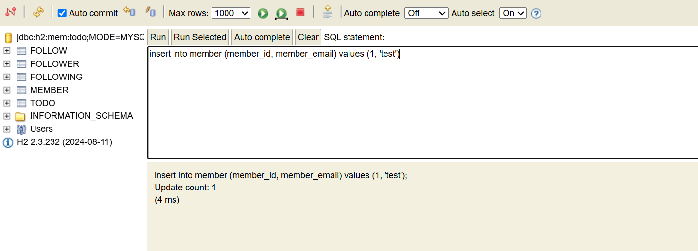
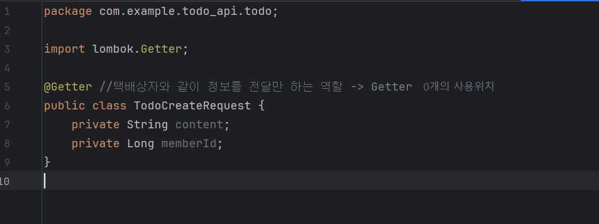
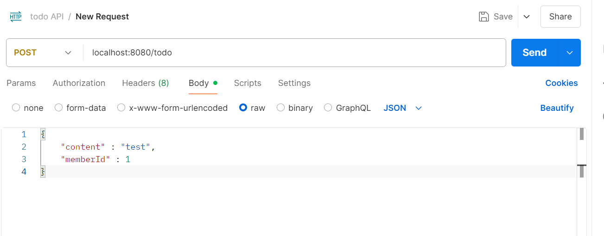
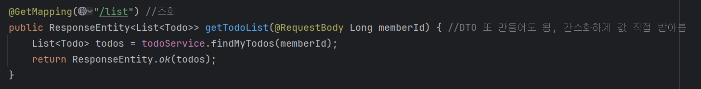
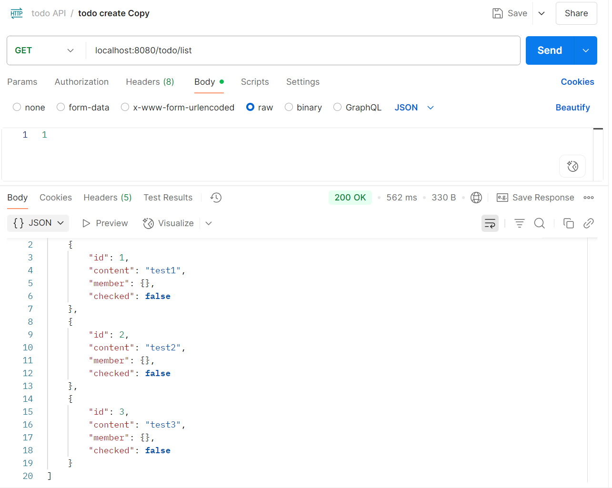

## 서비스 계층

서비스 계층 : 어플리케이션의 비즈니스 로직이 담기는 계층. 레포지토리 계층과 소통하며 엔티티, 또는 DTO로 소통한다.

### 비즈니스 로직

예를 들어, “할 일을 생성한다.” 이 명령에는

- 할 일을 인당 최대 10개까지 생성할 수 있다.

와 같은 조건이 있을 수 있다. 또한, “할 일을 수정한다.” 의 명령에는

- 할 일은 그 일을 생성한 유저만 수정할 수 있다.

이렇게 정책에 대한 조건과 제한 사항을 두는 것을 비즈니스 로직이라고 한다.

이와 같은 상황을 프로그래밍 하기 위해서는 우선 할 일을 생성하려는 유저를 조회하고, 그 유저가 생성한 모든 할 일 을 조회한 뒤, 모든 할 일의 개수가 10개 미만인지 확인하고, 그렇다면 할 일을 생성하는 단계로 구현하면 될 것이다. 

프로그램 진행 도중 에러가 발생한다면?

- 유저가 존재하지 않는다면? 모든 할 일의 개수가 10개 이상이라면?
    
    → 로직을 끊어주는 예외 처리가 필요할 수 있다.
    

그렇다면 이런 상황에서는 어떨까?

1. A 데이터를 생성한다
2. B 데이터를 생성한다
3. A, B데이터를 이용해 C 데이터를 생성한다.

만약 B 데이터 생성에 실패했다면? 2, 3단계 진행이 불가하니 예외 처리를 해 주면 될 것이다. 그런데 이때, 1번에서 A 데이터는 어떻게 처리해야 하는가? C 데이터가 정상적으로 생성되었다면 A 데이터는 남겨져 있고, 그렇지 않다면 다시 삭제되어야 용량을 최적화 할 수 있을 것이다. 그러므로 이 세 로직은 한번에 모두 다 정상적으로 실행되거나, 셋 다 실행되지 않아야 한다. 이런 로직을 **원자성을 가진 로직**이라고 한다.

→ **메서드 단위로 트랜잭션을 적용**해 구현할 수 있다!!

레포지토리가 아니라 서비스 계층에서 트랜잭션을 적용해야 원자성을 가진 로직을 제대로 구현할 수 있다.

content, user는 클라이언트가 제공하는 정보이므로 컨트롤러로부터 받아서 저장하도록 수정한다. 이때 user는 모든 정보를 받는 것이 아닌, user_id만 받고 DB에서 조회해서 저장하는 방식으로 수행한다. user_id만 맏고 서버에서 진짜 유저 객체를 조회해야 보안상 안전하다. 데이터 무결성을 유지할 수 있음.

## 컨트롤러 계층

클라이언트의 요청을 받고, 응답을 보내주는 계층이다. DTO(Data Transfer Object)를 사용하여 서비스 계층과 데이터를 주고받는다. HTTP 요청이 오면 전용 컨트롤러를 통해 HTTP 응답을 한다.

컨트롤러 안에 GET /todo /list 처리 메서드, POST /todo 메서드 등이 있음

HTTP데이터는 헤더와 바디로 나뉘어지는데, 어플리케이션과 관련된 데이터는 주로 body에 담긴다.

요청으로 보내는 데이터는 Request Body, 응답으로 보내는 데이터는 Response Body에 담긴다.

API 서버는 json 데이터를 응답하는 경우가 많기 때문에, @ResponseBody 어노테이션을 이용해 객체를 json 데이터로 변환하여 응답한다.

콘솔에서 SQL을 이용해 직접 정보를 추가해준 다음,

에 맞춰서

send해본다.

DTO를 만들지 않았을 경우에는

아이디만 입력해도 이렇게 조회해준다.

나머지는 시간 이슈로… 😢